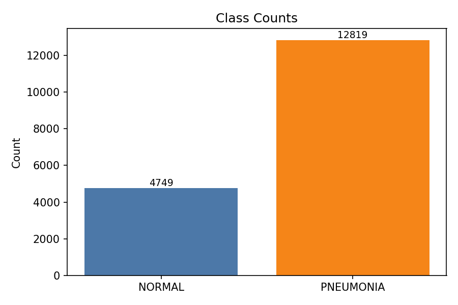
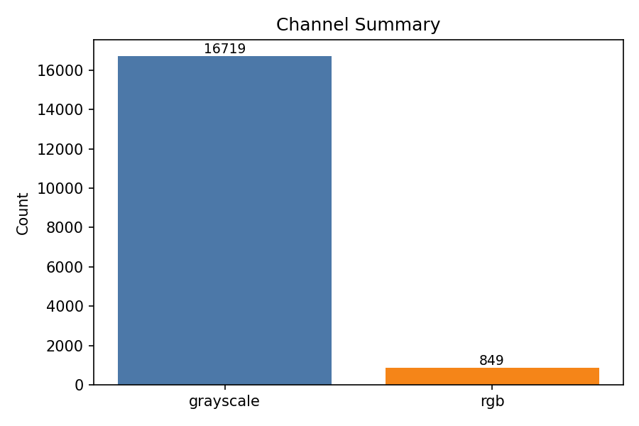
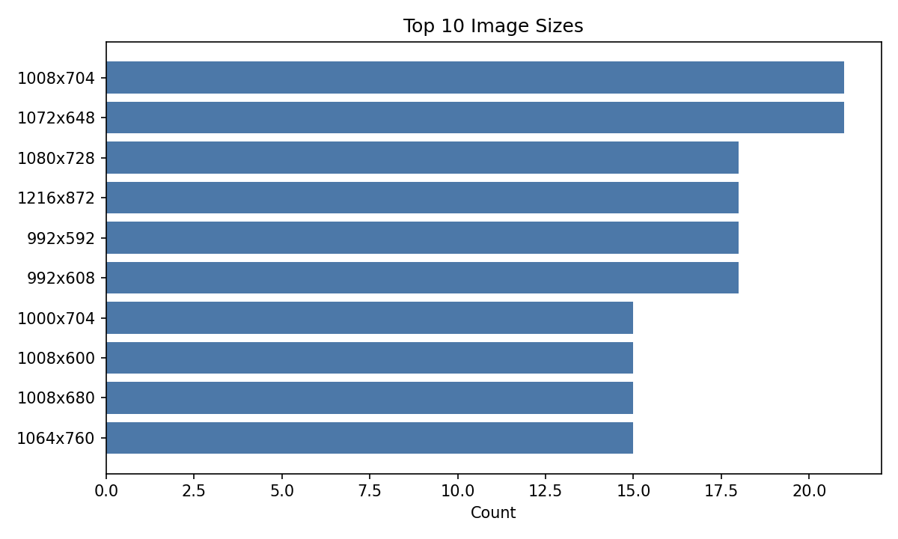
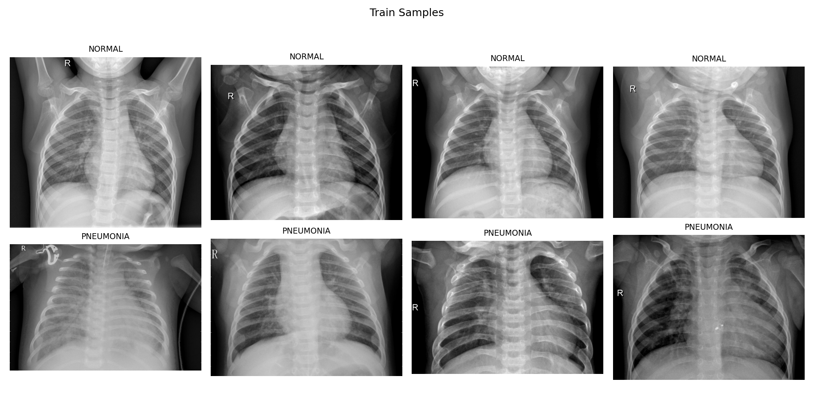
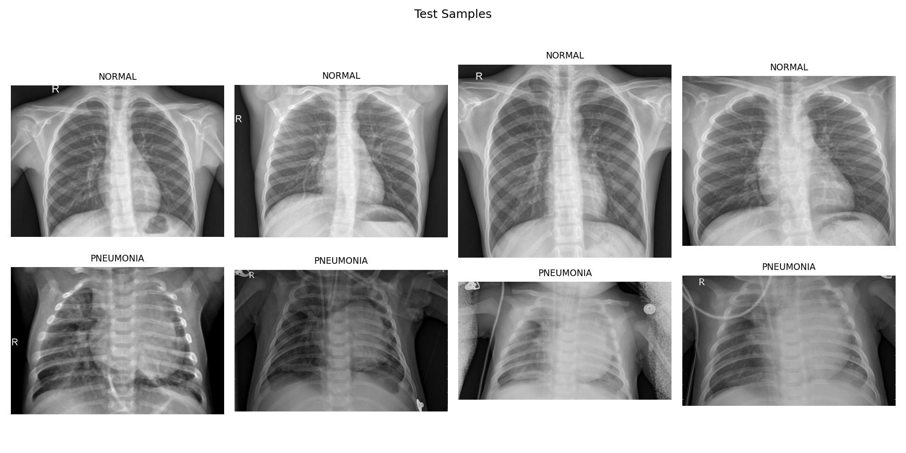
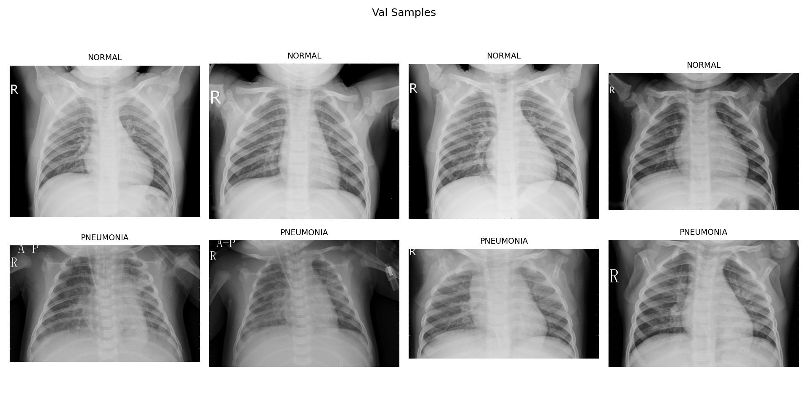

# Data Overview

- Total images: 17568
- Class counts: NORMAL: 4749, PNEUMONIA: 12819
- Width range: 384 - 2916, Height range: 127 - 2713

## Class Distribution

## Channel Summary

## Top Image Sizes

## Sample Visualizations

### Train

### Test

### Val

